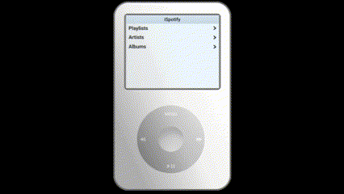

# iSpotify

Welcome to my dream Spotify player, a virtual iPod UI with Spotify serving as it's operating system!

It's a work in progress but this is V2 with way better UI and way more optimized API usage than before.

Features To Be Started
Search tracks
Play Searched Tracks
Create Playlists
Play Podcasts

## Want to use?

Right now it's in developer mode witch means i'll need to whitelist you to use the app but you can run it locally.

- Create a Spotify App and get your CLIENT_ID, CLIENT_SECRET.

- Choose to use Web API Web, Playback SDK

- Create .env.local and add > \*.env .env < to .gitignore
- Add CLIENT_ID, CLIENT_SECRET in .env

TEMPLATE FOR .env

- SPOTIFY_CLIENT_ID=CLIENT_ID
- SPOTIFY_CLIENT_SECRET=CLIENT_SECRET
- NEXTAUTH_SECRET=srandom_string_for_nextauth

- npm i npm run dev
